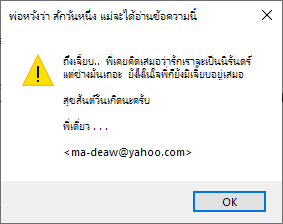

# มะเดี่ยว/Esc@pe!!
Macro Virus ที่ทำงานภายใต้ Microsoft Word เพื่อใช้ส่งต่อ [จดหมายอาลัยอาวรณ์](print.pdf) ถึงอดีตคนรักที่ชื่อ `เจี๊ยบ`

`มะเดี่ยว/Esc@pe!!` ถูกเขียนขึ้นโดยบุคคลที่ใช้ชื่อว่า `พี่เดี่ยว <ma-deaw@yahoo.com>`

## ที่มาที่ไป
ผมบังเอิญค้นพบ Source code ของ `มะเดี่ยว/Esc@pe!!` ที่ถูกเก็บไว้ใน Harddisk ลูกเก่า และเกิดความสงสัยว่า ใครคือ `พี่เดี่ยว` กับ `เจี๊ยบ` กันแน่ และก็สงสัยอีกด้วยว่า `เจี๊ยบ` จะได้อ่าน [จดหมายอาลัยอาวรณ์](print.pdf) แล้วหรือยัง?

การเผยแพร่ในครั้งนี้ ก็เพื่อการศึกษา และด้วยหวังว่า `พี่เดี่ยว` อาจจะผ่านมาเห็นและได้รับรู้ว่า สิ่งที่ `พี่เดี่ยว` ทำลงไปนั้น มันยังคงดำรงอยู่ถึงทุกวันนี้

## อาการ
`มะเดี่ยว/Esc@pe!!` จะคอยแอบทำงานอยู่อย่างเงียบ ๆ ใน Microsoft Word 

เมื่อมีการปิดเอกสารหรือปิดโปรแกรมในวันที่ 26 กุมภาพันธ์, 1 กรกฎาคม หรือ 26 กันยายน

จะแสดงข้อความ 
    
[จดหมายอาลัยอาวรณ์](print.pdf) 

ออกทางเครื่องพิมพ์ 

และ Message Box

    

## การติดต่อ
`มะเดี่ยว/Esc@pe!!` สามารถติดต่อได้ผ่านทางการเปิดเอกสาร Microsoft Word ที่มีไวรัสฝังตัวอยู่ หรือการบันทึกเอกสารจากโปรแกรม Microsoft Word ที่มีไวรัสแอบแฝงอยู่

## รายละเอียดเชิงเทคนิค

ไวรัส `มะเดี่ยว/Esc@pe!!` จะทำการติดตั้งตัวเองลงไปใน Normal Template ของ Microsoft Word เพื่อให้สามารถติดต่อไปยังเอกสารไฟล์อื่นๆ ได้

เมื่อถูกตั้งตั้งแล้ว ไวรัสจะทำการดักจับ Events ต่าง ๆ ผ่านทาง [Auto Macros](https://docs.microsoft.com/en-us/office/vba/word/concepts/customizing-word/auto-macros) เพื่อใช้ในการแสดงอาการของไวรัสและสำเนาตัวเองไปยังเอกสารอื่น ๆ ต่อไป

นอกจากนี้ ไวรัสยังทำการซ่อนตัวเอง ไม่ให้สามารถเปิดดู Source code ได้ โดยการทำ [Stealth Menus](http://ivanlef0u.fr/repo/madchat/vxdevl/vdat/tusimstl.htm)

